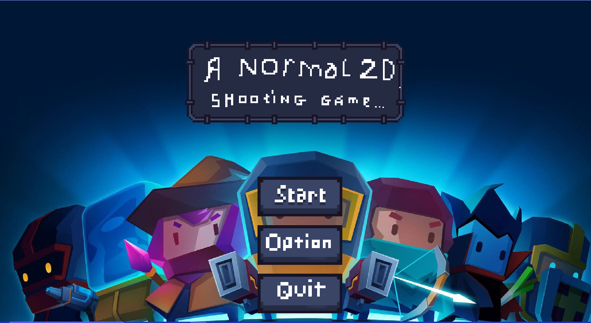

# 2D Normal Shooting Game

  
*An absolutely normal 2D shooting game built with Python and Pygame*

## 📜 Game Description
2D Normal Shooting Game is an absolutely normal 2D shooter where players control a character battling enemies in one single environment(will be updated in the future). Developed with Python and Pygame, it offers a smooth and engaging gaming experience.

## 🎮 How to Play
### Controls
- **Arrow Keys (WASD)**: Move character
- **P Key**: Pause game/Exit menu

### Objectives
- Destroy as many enemies as possible
- Avoid collisions with enemies
- Collect items to upgrade your character
- Progress through increasingly difficult levels

## 🛠️ System Requirements
- OS: Windows 7/10/11
- Python 3.8+
- Pygame 2.0+
- RAM: Minimum 1GB
- Storage: 50MB free space

## ⚙️ Installation
### Method 1: Run from Source
1. Ensure Python 3.8+ is installed from [python.org](https://www.python.org/downloads/)
2. Clone the repository:
   ```bash
   git clone [REPOSITORY_URL]
   cd 2D_Normal_Shooting_Game/src
   ```
3. Install required libraries:
   ```bash
   pip install -r requirements.txt
   ```
4. Run the game:
   ```bash
   python start_game.py
   ```

### Method 2: Run Executable (Windows)
1. Download `2D_Normal_Shooting_Game.exe` from the github release
2. Double-click to run the game

## 🎛️ Key Features
- Progressive level system with increasing difficulty
- Various enemy types and boss battles
- Upgrade and power-up system
- Immersive sound effects and visuals
- Score tracking
- User-friendly interface and menus

## 🗂️ Project Structure
```
2D_Normal_Shooting_Game/
├── src/                    # Source code
│   ├── Game/               # Main game logic
│   │   ├── assets/         # Game assets (images, sounds)
│   │   ├── components/     # Game components
│   │   ├── core/           # Core game engine
│   │   ├── entities/       # Game objects
│   │   ├── managers/       # Game managers
│   │   └── utils/          # Utility functions
│   └── Menu/               # Menu system
│       ├── assets/         # Menu assets
│       ├── components/     # UI components
│       ├── config/         # Configuration
│       ├── managers/       # Screen managers
│       ├── scenes/         # Game scenes
│       └── utils/          # Menu utilities
└── README.md               # This document
```

## 👥 Contributing
We welcome contributions to the project! If you'd like to contribute, please:

1. Fork the repository
2. Create a new branch (`git checkout -b feature/AmazingFeature`)
3. Commit your changes (`git commit -m 'Add some AmazingFeature'`)
4. Push to the branch (`git push origin feature/AmazingFeature`)
5. Open a Pull Request

## 📜 License
This project is licensed under the [MIT License](LICENSE).
Game BGM is copyrighted by Arknights
Menu BGM is copyrighted by Sky Force Reloaded
Game SFX is copyrighted by Pixabay

## ✉️ Contact
For any questions or contributions, please contact:
- Name: Bui Bao Long
- Email: nq2019.buibaolong281104@gmail.com
- Project: [GitHub/Website Link](https://github.com/GDevNeON/2D_Normal_Shooting_Game.git)

## 🙏 Acknowledgments
- Thanks to the Pygame community for the amazing framework
- Gratitude to all open-source developers for their contributions
- Special thanks to all the players for their support!
